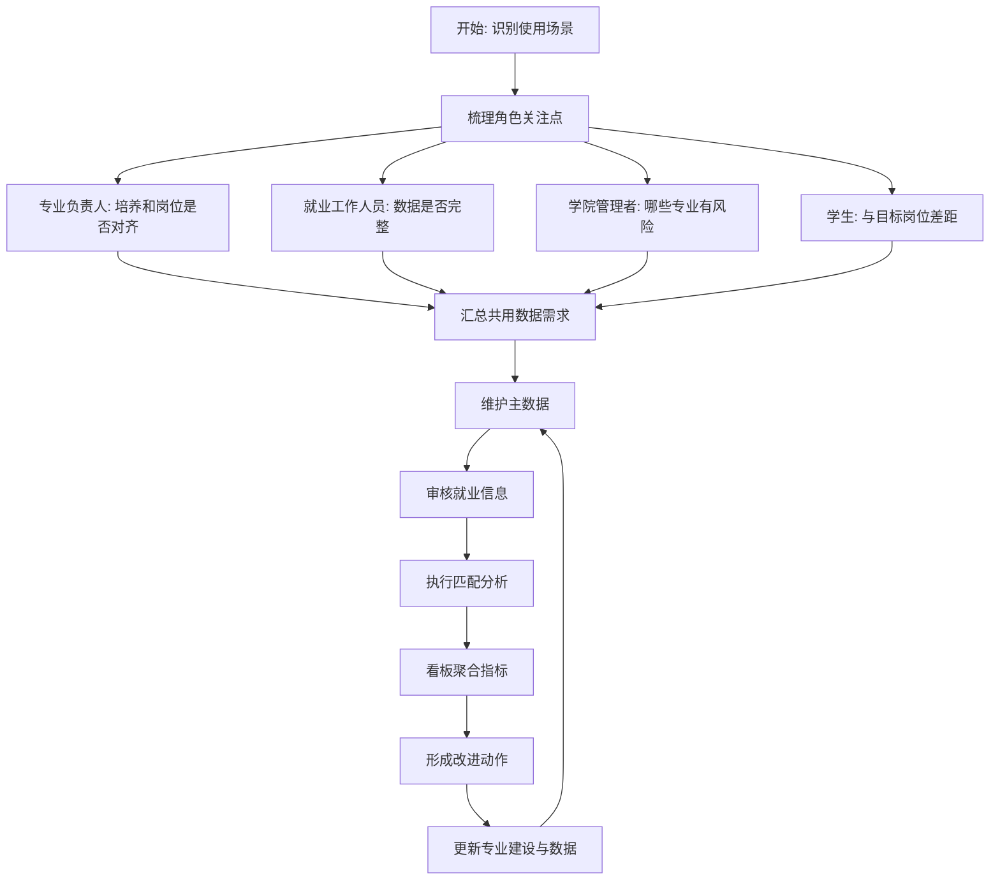

# 3.1 场景法分析流程图

```mermaid
flowchart TD
    A[开始: 识别使用场景] --> B[梳理角色关注点]
    B --> B1[专业负责人: 培养和岗位是否对齐]
    B --> B2[就业工作人员: 数据是否完整]
    B --> B3[学院管理者: 哪些专业有风险]
    B --> B4[学生: 与目标岗位差距]

    B1 --> C[汇总共用数据需求]
    B2 --> C
    B3 --> C
    B4 --> C

    C --> D[维护主数据]
    D --> E[审核就业信息]
    E --> F[执行匹配分析]
    F --> G[看板聚合指标]
    G --> H[形成改进动作]
    H --> I[更新专业建设与数据]
    I --> D
```

