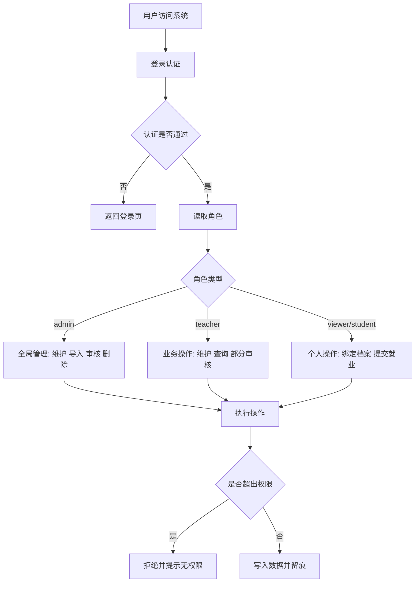

# 3.2 角色与权限流程图

```mermaid
flowchart TD
    A[用户访问系统] --> B[登录认证]
    B --> C{认证是否通过}
    C -- 否 --> D[返回登录页]
    C -- 是 --> E[读取角色]

    E --> F{角色类型}
    F -- admin --> G[全局管理: 维护 导入 审核 删除]
    F -- teacher --> H[业务操作: 维护 查询 部分审核]
    F -- viewer/student --> I[个人操作: 绑定档案 提交就业]

    G --> J[执行操作]
    H --> J
    I --> J

    J --> K{是否超出权限}
    K -- 是 --> L[拒绝并提示无权限]
    K -- 否 --> M[写入数据并留痕]
```

