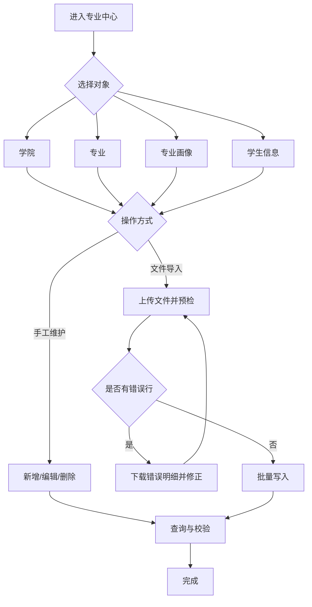

# 3.3.1 专业中心流程图

```mermaid
flowchart TD
    A[进入专业中心] --> B{选择对象}
    B --> B1[学院]
    B --> B2[专业]
    B --> B3[专业画像]
    B --> B4[学生信息]

    B1 --> C{操作方式}
    B2 --> C
    B3 --> C
    B4 --> C

    C -- 手工维护 --> D[新增/编辑/删除]
    C -- 文件导入 --> E[上传文件并预检]

    E --> F{是否有错误行}
    F -- 是 --> G[下载错误明细并修正]
    G --> E
    F -- 否 --> H[批量写入]

    D --> I[查询与校验]
    H --> I
    I --> J[完成]
```

