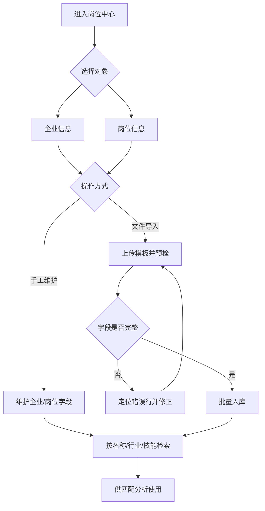

# 3.3.2 岗位中心流程图

```mermaid
flowchart TD
    A[进入岗位中心] --> B{选择对象}
    B --> B1[企业信息]
    B --> B2[岗位信息]

    B1 --> C{操作方式}
    B2 --> C

    C -- 手工维护 --> D[维护企业/岗位字段]
    C -- 文件导入 --> E[上传模板并预检]

    E --> F{字段是否完整}
    F -- 否 --> G[定位错误行并修正]
    G --> E
    F -- 是 --> H[批量入库]

    D --> I[按名称/行业/技能检索]
    H --> I
    I --> J[供匹配分析使用]
```

