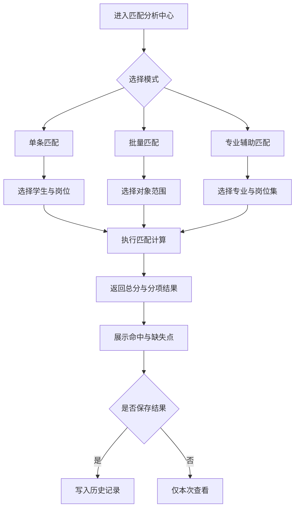

# 3.3.3 匹配分析中心流程图

```mermaid
flowchart TD
    A[进入匹配分析中心] --> B{选择模式}
    B --> B1[单条匹配]
    B --> B2[批量匹配]
    B --> B3[专业辅助匹配]

    B1 --> C[选择学生与岗位]
    B2 --> D[选择对象范围]
    B3 --> E[选择专业与岗位集]

    C --> F[执行匹配计算]
    D --> F
    E --> F

    F --> G[返回总分与分项结果]
    G --> H[展示命中与缺失点]
    H --> I{是否保存结果}
    I -- 是 --> J[写入历史记录]
    I -- 否 --> K[仅本次查看]
```

