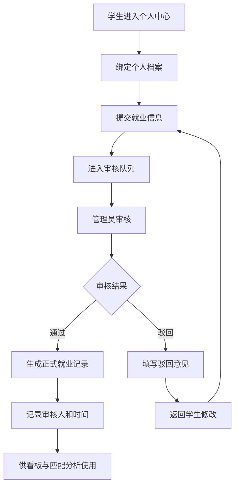

# 3.3.4 审核中心/个人中心关联流程图

```mermaid
flowchart TD
    A[学生进入个人中心] --> B[绑定个人档案]
    B --> C[提交就业信息]
    C --> D[进入审核队列]
    D --> E[管理员审核]

    E --> F{审核结果}
    F -- 通过 --> G[生成正式就业记录]
    F -- 驳回 --> H[填写驳回意见]
    H --> I[返回学生修改]
    I --> C

    G --> J[记录审核人和时间]
    J --> K[供看板与匹配分析使用]
```

