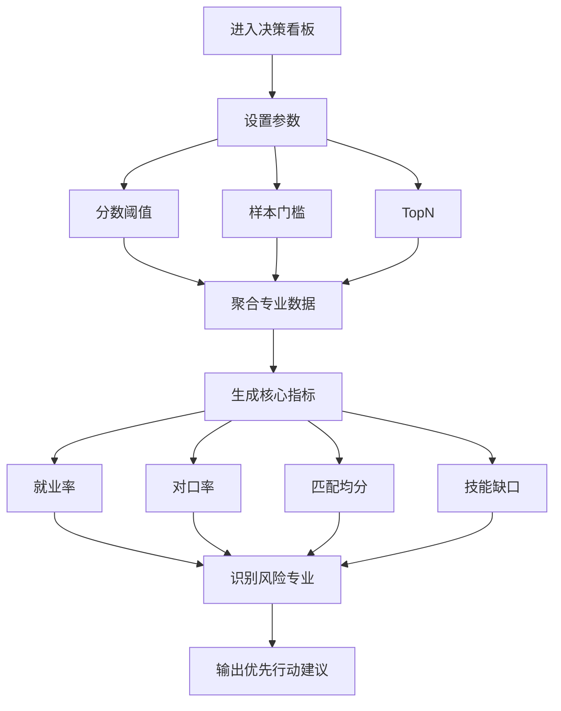

# 3.3.5 决策看板流程图

```mermaid
flowchart TD
    A[进入决策看板] --> B[设置参数]
    B --> B1[分数阈值]
    B --> B2[样本门槛]
    B --> B3[TopN]

    B1 --> C[聚合专业数据]
    B2 --> C
    B3 --> C

    C --> D[生成核心指标]
    D --> D1[就业率]
    D --> D2[对口率]
    D --> D3[匹配均分]
    D --> D4[技能缺口]

    D1 --> E[识别风险专业]
    D2 --> E
    D3 --> E
    D4 --> E

    E --> F[输出优先行动建议]
```

