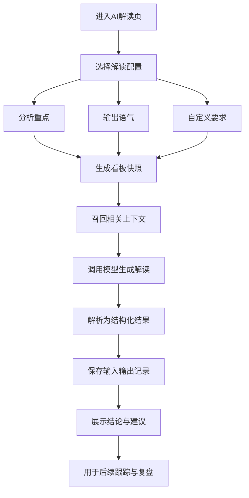

# 3.3.6 AI/Agent解读模块流程图

```mermaid
flowchart TD
    A[进入AI解读页] --> B[选择解读配置]
    B --> B1[分析重点]
    B --> B2[输出语气]
    B --> B3[自定义要求]

    B1 --> C[生成看板快照]
    B2 --> C
    B3 --> C

    C --> D[召回相关上下文]
    D --> E[调用模型生成解读]
    E --> F[解析为结构化结果]
    F --> G[保存输入输出记录]
    G --> H[展示结论与建议]
    H --> I[用于后续跟踪与复盘]
```

