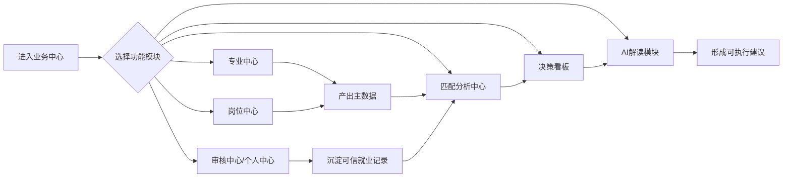

# 3.3 功能需求分析（总览）流程图

```mermaid
flowchart LR
    A[进入业务中心] --> B{选择功能模块}
    B --> C[专业中心]
    B --> D[岗位中心]
    B --> E[匹配分析中心]
    B --> F[审核中心/个人中心]
    B --> G[决策看板]
    B --> H[AI解读模块]

    C --> I[产出主数据]
    D --> I
    F --> J[沉淀可信就业记录]
    I --> E
    J --> E
    E --> G
    G --> H
    H --> K[形成可执行建议]
```

