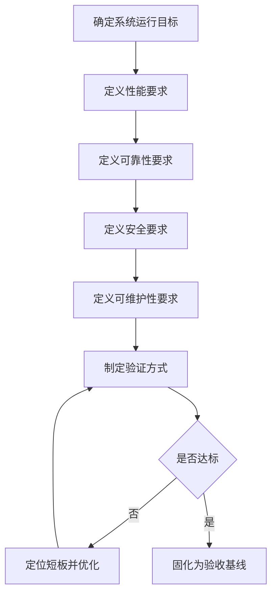

# 3.4 非功能性需求分析流程图

```mermaid
flowchart TD
    A[确定系统运行目标] --> B[定义性能要求]
    B --> C[定义可靠性要求]
    C --> D[定义安全要求]
    D --> E[定义可维护性要求]
    E --> F[制定验证方式]
    F --> G{是否达标}
    G -- 否 --> H[定位短板并优化]
    H --> F
    G -- 是 --> I[固化为验收基线]
```

