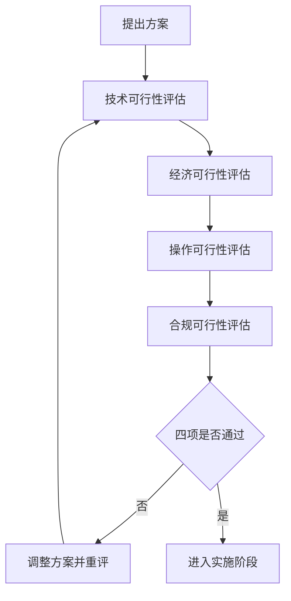

# 3.5 可行性分析流程图

```mermaid
flowchart TD
    A[提出方案] --> B[技术可行性评估]
    B --> C[经济可行性评估]
    C --> D[操作可行性评估]
    D --> E[合规可行性评估]
    E --> F{四项是否通过}
    F -- 否 --> G[调整方案并重评]
    G --> B
    F -- 是 --> H[进入实施阶段]
```

