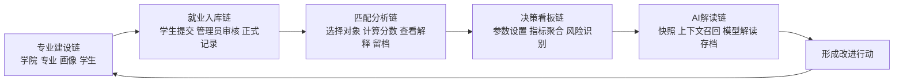

# 3.6 主要业务流程分析流程图

```mermaid
flowchart LR
    A[专业建设链<br/>学院 专业 画像 学生] --> B[就业入库链<br/>学生提交 管理员审核 正式记录]
    B --> C[匹配分析链<br/>选择对象 计算分数 查看解释 留档]
    C --> D[决策看板链<br/>参数设置 指标聚合 风险识别]
    D --> E[AI解读链<br/>快照 上下文召回 模型解读 存档]
    E --> F[形成改进行动]
    F --> A
```

