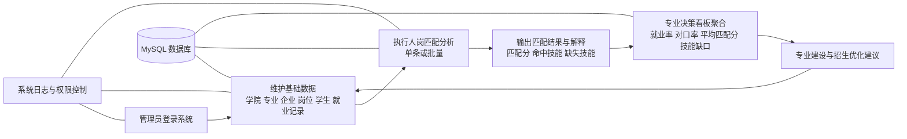

# 答辩用简化流程图（v0.1）

该版本用于答辩展示，突出“业务闭环”与“系统价值”，省略实现细节。

```mermaid
flowchart LR
    A[管理员登录系统] --> B[维护基础数据<br/>学院 专业 企业 岗位 学生 就业记录]
    B --> C[执行人岗匹配分析<br/>单条或批量]
    C --> D[输出匹配结果与解释<br/>匹配分 命中技能 缺失技能]
    D --> E[专业决策看板聚合<br/>就业率 对口率 平均匹配分 技能缺口]
    E --> F[专业建设与招生优化建议]
    F --> B

    G[(MySQL 数据库)] --- B
    G --- C
    G --- E
    H[系统日志与权限控制] --- A
    H --- B
    H --- C
```

## 答辩讲解建议（30 秒）

1. 先说明系统从“数据管理”出发，统一沉淀就业与专业画像数据。  
2. 再说明匹配引擎产出可解释结果，不只是一个分数。  
3. 最后强调看板支持专业优化决策，并形成“数据-分析-决策-再优化”的闭环。

