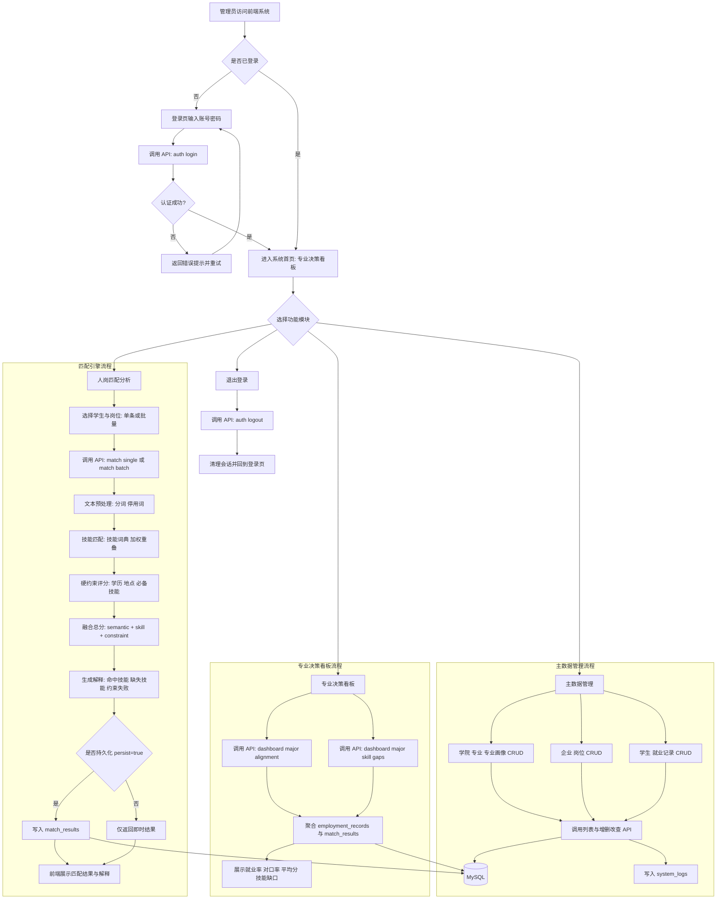

# 功能设计流程图（v0.1）

下面流程图按当前项目已实现功能组织，覆盖认证、主数据管理、人岗匹配、专业看板与系统日志。

```mermaid
flowchart TD
    A[管理员访问前端系统] --> B{是否已登录}
    B -- 否 --> C[登录页输入账号密码]
    C --> D[调用 API: auth login]
    D --> E{认证成功?}
    E -- 否 --> C1[返回错误提示并重试]
    C1 --> C
    E -- 是 --> F[进入系统首页: 专业决策看板]
    B -- 是 --> F

    F --> G{选择功能模块}
    G --> H[主数据管理]
    G --> I[人岗匹配分析]
    G --> J[专业决策看板]
    G --> K[退出登录]

    subgraph S1 [主数据管理流程]
        H --> H1[学院 专业 专业画像 CRUD]
        H --> H2[企业 岗位 CRUD]
        H --> H3[学生 就业记录 CRUD]
        H1 --> H4[调用列表与增删改查 API]
        H2 --> H4
        H3 --> H4
        H4 --> DB[(MySQL)]
        H4 --> LOG[写入 system_logs]
    end

    subgraph S2 [匹配引擎流程]
        I --> M1[选择学生与岗位: 单条或批量]
        M1 --> M2[调用 API: match single 或 match batch]
        M2 --> M3[文本预处理: 分词 停用词]
        M3 --> M4[技能匹配: 技能词典 加权重叠]
        M4 --> M5[硬约束评分: 学历 地点 必备技能]
        M5 --> M6[融合总分: semantic + skill + constraint]
        M6 --> M7[生成解释: 命中技能 缺失技能 约束失败]
        M7 --> M8{是否持久化 persist=true}
        M8 -- 是 --> M9[写入 match_results]
        M8 -- 否 --> M10[仅返回即时结果]
        M9 --> DB
        M9 --> M11[前端展示匹配结果与解释]
        M10 --> M11
    end

    subgraph S3 [专业决策看板流程]
        J --> D1[调用 API: dashboard major alignment]
        J --> D2[调用 API: dashboard major skill gaps]
        D1 --> D3[聚合 employment_records 与 match_results]
        D2 --> D3
        D3 --> DB
        D3 --> D4[展示就业率 对口率 平均分 技能缺口]
    end

    K --> L[调用 API: auth logout]
    L --> M[清理会话并回到登录页]
```

