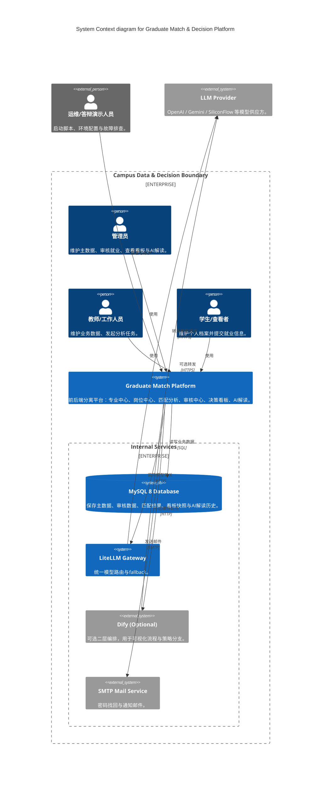
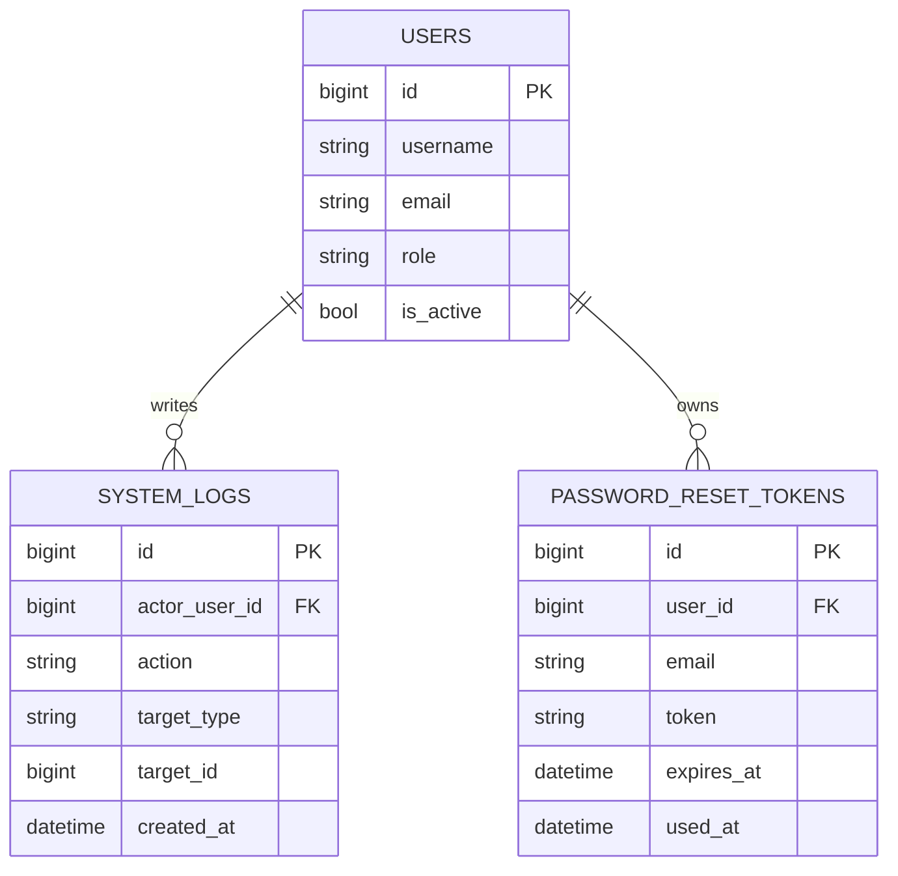
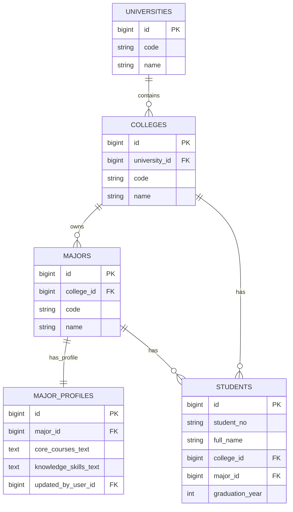
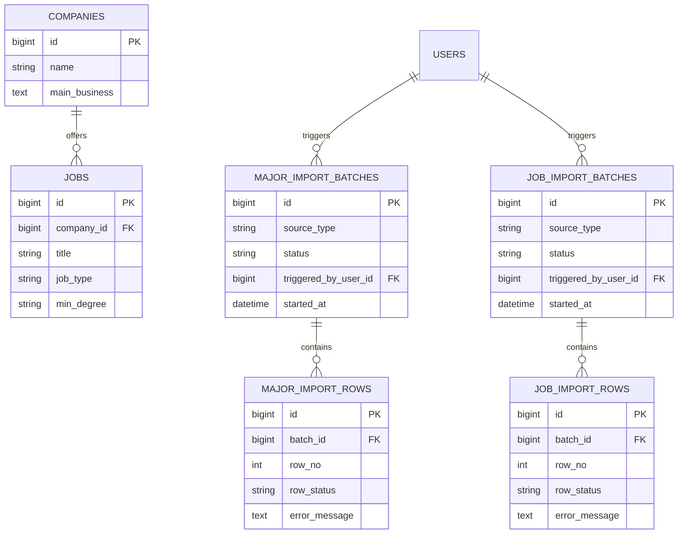
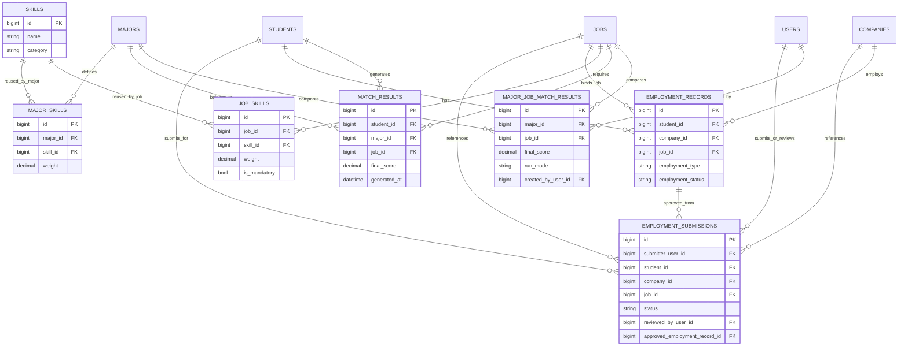
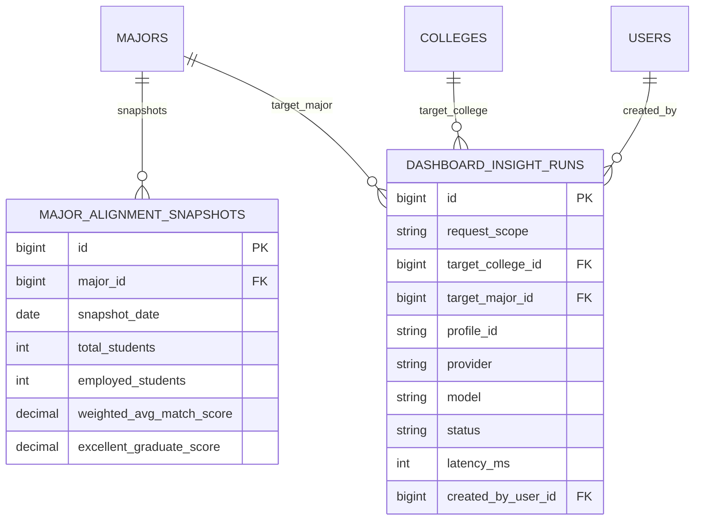
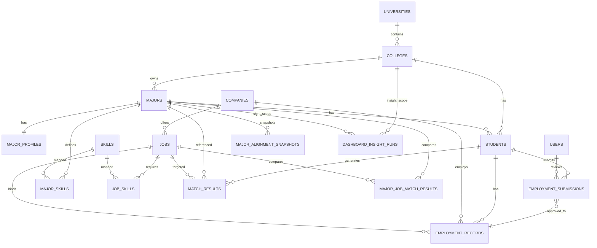

# 系统建模图（Mermaid）

> 依据当前项目实现（`db/schema.sql` + `backend/docs/api_contract.md`）整理。

## 1) 总体架构设计图（C4Context）

## 2) 接口关系图（architecture-beta）

## 3) 数据库关系图（按族类）

### 3.1 认证与审计族

### 3.2 教学主数据族

### 3.3 岗位主数据与导入族

### 3.4 就业审核与匹配族

### 3.5 看板与AI解读族

## 4) 全关系图（简化版，保留核心）

## 5) 全关系图（详细版）

```mermaid
erDiagram
    USERS ||--o{ SYSTEM_LOGS : writes
    USERS ||--o{ PASSWORD_RESET_TOKENS : owns
    USERS ||--o{ MAJOR_IMPORT_BATCHES : triggers
    USERS ||--o{ JOB_IMPORT_BATCHES : triggers
    USERS ||--o{ EMPLOYMENT_SUBMISSIONS : submits_or_reviews
    USERS ||--o{ MAJOR_JOB_MATCH_RESULTS : creates
    USERS ||--o{ DASHBOARD_INSIGHT_RUNS : creates
    USERS ||--o{ MAJOR_PROFILES : updates

    UNIVERSITIES ||--o{ COLLEGES : contains
    COLLEGES ||--o{ MAJORS : owns
    MAJORS ||--|| MAJOR_PROFILES : has_profile
    COLLEGES ||--o{ STUDENTS : has
    MAJORS ||--o{ STUDENTS : has

    COMPANIES ||--o{ JOBS : offers
    STUDENTS ||--o{ EMPLOYMENT_RECORDS : has
    COMPANIES ||--o{ EMPLOYMENT_RECORDS : employs
    JOBS ||--o{ EMPLOYMENT_RECORDS : binds_job

    STUDENTS ||--o{ EMPLOYMENT_SUBMISSIONS : submits_for
    COMPANIES ||--o{ EMPLOYMENT_SUBMISSIONS : optional_ref_company
    JOBS ||--o{ EMPLOYMENT_SUBMISSIONS : optional_ref_job
    EMPLOYMENT_RECORDS ||--o{ EMPLOYMENT_SUBMISSIONS : approved_from

    MAJOR_IMPORT_BATCHES ||--o{ MAJOR_IMPORT_ROWS : contains
    JOB_IMPORT_BATCHES ||--o{ JOB_IMPORT_ROWS : contains

    SKILLS ||--o{ MAJOR_SKILLS : reused
    SKILLS ||--o{ JOB_SKILLS : reused
    MAJORS ||--o{ MAJOR_SKILLS : maps
    JOBS ||--o{ JOB_SKILLS : maps

    STUDENTS ||--o{ MATCH_RESULTS : generates
    MAJORS ||--o{ MATCH_RESULTS : referenced
    JOBS ||--o{ MATCH_RESULTS : targets

    MAJORS ||--o{ MAJOR_JOB_MATCH_RESULTS : compares
    JOBS ||--o{ MAJOR_JOB_MATCH_RESULTS : compares

    MAJORS ||--o{ MAJOR_ALIGNMENT_SNAPSHOTS : snapshots
    COLLEGES ||--o{ DASHBOARD_INSIGHT_RUNS : scope_college
    MAJORS ||--o{ DASHBOARD_INSIGHT_RUNS : scope_major

    USERS {
        bigint id PK
        string username
        string email
        string role
        bigint linked_student_id
        bool is_active
        datetime created_at
    }
    SYSTEM_LOGS {
        bigint id PK
        bigint actor_user_id FK
        string action
        string target_type
        bigint target_id
        json details_json
        datetime created_at
    }
    PASSWORD_RESET_TOKENS {
        bigint id PK
        bigint user_id FK
        string email
        string token
        datetime expires_at
        datetime used_at
    }
    UNIVERSITIES {
        bigint id PK
        string code
        string name
        string province
        string city
    }
    COLLEGES {
        bigint id PK
        bigint university_id FK
        string code
        string name
    }
    MAJORS {
        bigint id PK
        bigint college_id FK
        string code
        string name
    }
    MAJOR_PROFILES {
        bigint id PK
        bigint major_id FK
        text core_courses_text
        text knowledge_skills_text
        text technical_platform_text
        text capability_text
        bigint updated_by_user_id FK
    }
    COMPANIES {
        bigint id PK
        string name
        text main_business
        text flagship_products
        text domain_area
        text application_industries
    }
    JOBS {
        bigint id PK
        bigint company_id FK
        string title
        string job_type
        string min_degree
        text responsibilities_text
    }
    MAJOR_IMPORT_BATCHES {
        bigint id PK
        string source_type
        string source_filename
        string status
        bigint triggered_by_user_id FK
        int total_rows
        int valid_rows
        int invalid_rows
    }
    MAJOR_IMPORT_ROWS {
        bigint id PK
        bigint batch_id FK
        int row_no
        string row_status
        text error_message
        json raw_row_json
    }
    JOB_IMPORT_BATCHES {
        bigint id PK
        string source_type
        string source_filename
        string status
        bigint triggered_by_user_id FK
        int total_rows
        int valid_rows
        int invalid_rows
    }
    JOB_IMPORT_ROWS {
        bigint id PK
        bigint batch_id FK
        int row_no
        string row_status
        text error_message
        json raw_row_json
    }
    STUDENTS {
        bigint id PK
        string student_no
        string full_name
        string gender
        bigint college_id FK
        bigint major_id FK
        int graduation_year
    }
    EMPLOYMENT_RECORDS {
        bigint id PK
        bigint student_id FK
        bigint company_id FK
        bigint job_id FK
        string employment_type
        string employment_status
        date start_date
    }
    EMPLOYMENT_SUBMISSIONS {
        bigint id PK
        bigint submitter_user_id FK
        bigint student_id FK
        bigint company_id FK
        bigint job_id FK
        string proposed_company_name
        string proposed_job_title
        string status
        bigint reviewed_by_user_id FK
        bigint approved_employment_record_id FK
    }
    SKILLS {
        bigint id PK
        string name
        string category
    }
    MAJOR_SKILLS {
        bigint id PK
        bigint major_id FK
        bigint skill_id FK
        decimal weight
    }
    JOB_SKILLS {
        bigint id PK
        bigint job_id FK
        bigint skill_id FK
        decimal weight
        bool is_mandatory
    }
    MATCH_RESULTS {
        bigint id PK
        bigint student_id FK
        bigint major_id FK
        bigint job_id FK
        string algorithm_version
        decimal semantic_score
        decimal skill_score
        decimal constraint_score
        decimal final_score
        datetime generated_at
    }
    MAJOR_JOB_MATCH_RESULTS {
        bigint id PK
        bigint major_id FK
        bigint job_id FK
        string algorithm_version
        decimal final_score
        string run_mode
        bigint created_by_user_id FK
        datetime generated_at
    }
    MAJOR_ALIGNMENT_SNAPSHOTS {
        bigint id PK
        bigint major_id FK
        date snapshot_date
        int total_students
        int employed_students
        int aligned_students
        decimal weighted_avg_match_score
        decimal excellent_graduate_score
        int rank_position
    }
    DASHBOARD_INSIGHT_RUNS {
        bigint id PK
        string request_scope
        bigint target_college_id FK
        bigint target_major_id FK
        string profile_id
        string provider
        string model
        string focus
        string tone
        string status
        int latency_ms
        json snapshot_json
        json insight_json
        bigint created_by_user_id FK
        datetime created_at
    }
```

